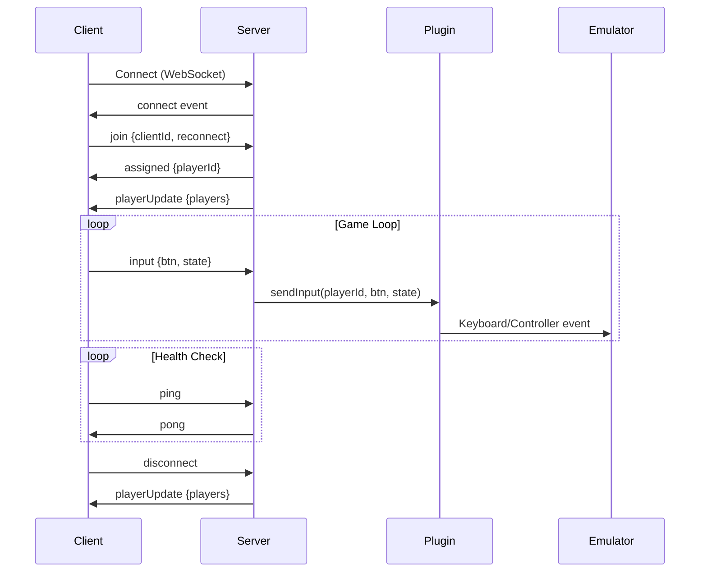

**Parameters**:
- `clientId` (string, required): Unique client identifier (persisted in localStorage)
- `reconnect` (boolean, optional): Whether this is a reconnection attempt

**Response**: Server emits `assigned` event

---

#### Send Input
```json
{
  "type": "input",
  "btn": "A",
  "state": 1
}
```

**Description**: Send controller input to server.

**Parameters**:
- `btn` (string, required): Button name
  - D-Pad: `Up`, `Down`, `Left`, `Right`
  - Action: `A`, `B`, `X`, `Y`
  - Shoulder: `L`, `R`, `ZL`, `ZR`
  - System: `Start`, `Select`
- `state` (number, required): Button state
  - `1` = pressed
  - `0` = released

---

#### Ping
```json
{
  "type": "ping"
}
```

**Description**: Health check ping to keep connection alive.

**Response**: Server emits `pong` event

---

### Server → Client

#### Player Assigned
```json
{
  "type": "assigned",
  "playerId": 1,
  "clientId": "uuid-v4",
  "roomId": "abc123"
}
```

**Description**: Confirms player assignment after joining.

**Parameters**:
- `playerId` (number): Assigned player number (1-4)
- `clientId` (string): Client's unique identifier
- `roomId` (string): Room identifier

---

#### Player Update
```json
{
  "type": "playerUpdate",
  "players": [
    {
      "playerId": 1,
      "clientId": "uuid-v4",
      "connected": true,
      "joinedAt": 1234567890
    }
  ]
}
```

**Description**: Broadcast when players join/leave/reconnect.

**Parameters**:
- `players` (array): List of all players in room

---

#### Pong
```json
{
  "type": "pong"
}
```

**Description**: Response to ping event.

---

#### Game Started
```json
{
  "type": "gameStarted"
}
```

**Description**: Broadcast when game starts.

---

#### Game Stopped
```json
{
  "type": "gameStopped"
}
```

**Description**: Broadcast when game stops.

---

#### Error
```json
{
  "type": "error",
  "message": "Room is full (max 4 players)"
}
```

**Description**: Error message from server.

---

## REST API

### GET /api/room

Get current room status.

**Response**:
```json
{
  "roomId": "abc123",
  "gameStarted": false,
  "playerCount": 2,
  "connectedCount": 2,
  "players": [...]

**Response**:
```json
{
  "success": true
}
```

---

### POST /api/stop

Stop the game.

**Response**:
```json
{
  "success": true
}
```

---

### GET /api/plugins

List available plugins.

**Response**:
{
  "plugins": [
    { "name": "ryujinx", "active": true }
  ],
  "active": {
    "name": "ryujinx",
    "version": "1.0.0",
    "description": "Ryujinx emulator integration"
  }
}
```

---

### POST /api/plugin/switch

Switch active plugin.

**Request**:
```json
{
  "plugin": "ryujinx",
  "config": {
    "keyBindings": {
      "A": "x",
      "B": "z"
    }
  }
}
```

**Response**:
```json
{
  "success": true,
  "plugin": {
    "name": "ryujinx",
    "version": "1.0.0",
    "description": "Ryujinx emulator integration"
  }
}
```

---

## Plugin Configuration

Default Ryujinx key bindings:

```json
{
  "activePlugin": "ryujinx",
  "plugins": {
    "ryujinx": {
      "enabled": true,
      "keyBindings": {
        "A": "x",
        "B": "z",
        "X": "s",
        "Y": "a",
        "L": "q",
        "R": "w",
        "ZL": "1",
        "ZR": "2",
        "Start": "return",
        "Select": "shift",
        "Up": "up",
        "Down": "down",
        "Left": "left",
        "Right": "right"
      }
    }
  }
}
```

---

## Error Codes

| Message | Cause | Solution |
|---------|-------|----------|
| `clientId is required` | Missing clientId in join event | Include clientId in request |
| `Room is full (max 4 players)` | All 4 player slots occupied | Wait for a player to leave |
| `Plugin "X" not found` | Invalid plugin name | Use valid plugin name |

---

## Connection Flow


