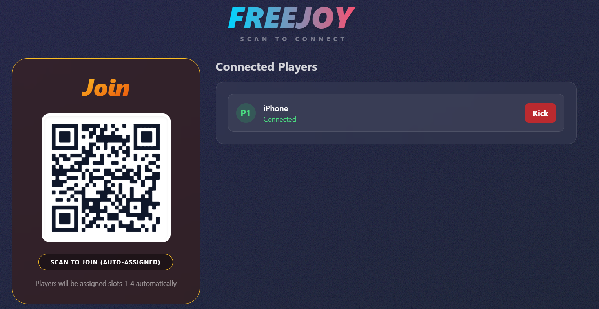
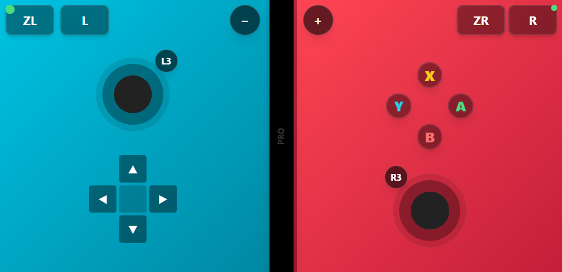

# FreeJoy - Universal Wireless Gamepad

FreeJoy is a full-stack controller solution that turns any mobile device into a low-latency gamepad for PC emulators. It features a Node.js/Socket.IO backend using `vgamepad` for virtual Xbox 360 controller emulation and a React frontend for the Pro Controller UI.

## ⚡ Main Features

*   **Zero-Config Connection**: Scan a single QR code to connect instantly - player slots are auto-assigned.
    
    

*   **Pro Controller Layout**: All players use the same full-featured Pro Controller UI with dual analog sticks.
    
    

*   **Virtual Gamepad Emulation**: Creates true Xbox 360 virtual controllers via Python's `vgamepad` library.
*   **Persistent Sessions**: Auto-reconnect logic restores player slots if the browser refreshes or device sleeps.
*   **Auto-Assignment**: Players are automatically assigned slots 1-4 in order of connection.
*   **Smart Layouts**: 
    *   **Landscape Lock**: Enforces landscape orientation for maximum playability.
    *   **Safe Area Handling**: Optimized for notched phones and tablets.
*   **Native Integration**: Uses ViGEmBus driver for true virtual Xbox 360 controller emulation.

## 🛠️ Architecture & Integration

FreeJoy is built on a modular, high-performance architecture.

### Virtual Gamepad Architecture
FreeJoy creates true virtual Xbox 360 controllers for each player:
*   **Main Server**: Handles WebSocket routing and room management.
*   **Python VGamepad Service**: Single Python process that manages all virtual controllers.
    *   Creates Xbox 360 gamepads on-demand via the ViGEmBus driver.
    *   Handles button presses, analog stick input, and triggers.
    *   Lazy-loads controllers only when players connect.

### Current Integration (Virtual Gamepad)
The system uses the **Ryujinx Virtual Gamepad Plugin** (`RyujinxPlugin.ts`):
1.  **Mobile Client** sends input events via WebSocket (optimized 60Hz updates).
2.  **Node.js Server** receives events and forwards them as JSON commands to Python.
3.  **Python Process** translates commands to vgamepad API calls.
4.  **ViGEmBus Driver** presents virtual Xbox 360 controllers to Windows.
5.  **Ryujinx Emulator** sees native gamepad input (no keyboard mapping needed).

## 🎮 Controller Mapping

### Pro Controller Layout (All Players)
All players use the same Pro Controller layout with full functionality:
*   **Action Buttons**: A, B, X, Y (position-mapped to Xbox layout)
*   **D-Pad**: Full directional pad
*   **Analog Sticks**: Left and Right sticks with L3/R3 buttons
*   **Shoulder Buttons**: L, R, ZL (Left Trigger), ZR (Right Trigger)
*   **System Buttons**: Plus (+), Minus (-)

### Button Mapping to Xbox 360
*   Switch A → Xbox B (bottom button)
*   Switch B → Xbox A (right button)
*   Switch X → Xbox Y (top button)
*   Switch Y → Xbox X (left button)
*   ZL/ZR → Left/Right Triggers (analog)
*   Plus/Minus → Start/Back

## 🔮 Roadmap & Future Development

Future plans to expand FreeJoy:

*   **WAN / Internet Play**: Enable remote connections for multiplayer gaming across different networks.
*   **DualShock 4 Support**: Add PlayStation controller emulation alongside Xbox 360.
*   **Multi-Plugin Support**: Support for other emulators (e.g., Dolphin, RPCS3) and native PC games.
*   **Customizable Layouts**: Allow users to rearrange buttons and adjust stick sensitivity.

## 🚀 Installation & Setup

### Method 1: The Launcher (Recommended)
The project includes a `Launcher.bat` (wrapper for `Launcher.ps1`) that handles the entire lifecycle:

1.  Run `Launcher.bat` as Administrator.
2.  Select **[1] Setup**:
    *   Checks Python installation (requires Python 3.7+).
    *   Installs `vgamepad` Python library and ViGEmBus driver.
    *   Installs `npm` dependencies for server and client.
    *   Builds the React client.
    *   **Firewall Rules**: Automatically allows inbound traffic on port 3000.
3.  Select **[2] Start Server** to run the application.

### Method 2: Manual Setup
If you prefer the command line:
```bash
# 1. Install Python Dependencies
pip install vgamepad

# 2. Install Server Deps
cd server && npm install

# 3. Install Client Deps & Build
cd ../client && npm install && npm run build

# 4. Start Server
cd ../server && npm start
```

## 🎮 Emulator Configuration

FreeJoy creates virtual Xbox 360 controllers that appear as native gamepads to Ryujinx.

1.  **Open Ryujinx Settings** → Input Configuration
2.  **Select Input Device**: Choose "Xbox 360 Controller for Windows" (you'll see one for each connected player)
3.  **Configure Controls**: Map the buttons using Ryujinx's automatic detection or manual mapping
4.  **Repeat for each player** (Player 1-4)

**Note**: Each mobile device that connects creates its own virtual Xbox 360 controller in Windows. You can verify this in:
- Windows Device Manager → Human Interface Devices → "Xbox 360 Controller for Windows"
- Ryujinx will automatically detect these controllers when they connect.

## 📱 Mobile Usage

1.  Open the host page (`http://localhost:3000`) on your PC.
2.  Scan the single QR code - you'll be automatically assigned to the first available player slot (1-4).
3.  **iOS Users**: Tap "Share" → "Add to Home Screen" to launch as a PWA.
4.  **Troubleshooting**:
    *   **Auto-Assignment**: Players are assigned slots 1-4 in order of connection. Reconnecting with the same device restores your previous slot.
    *   **Vibration**: Requires a user interaction (tap) to enable on iOS first.
    *   **Controller Not Detected**: Make sure ViGEmBus driver is installed (happens automatically during setup).

## 📄 License
MIT License - Free for personal and educational use.

---

## 🤖 Built with Antigravity

This entire project was crafted with the assistance of **Antigravity** - Google DeepMind's agentic AI coding assistant. From the neon-themed UI to the native C# launcher (RIP), from the draggable analog sticks to the 4-player keyboard mappings, every line of code was a collaborative dance between human creativity and AI precision.

> *"Any sufficiently advanced AI is indistinguishable from a very caffeinated developer at 3 AM."*  
> — Arthur C. Clarke (probably)

Special thanks to Antigravity for:
- 🎨 Making the Controller aesthetics actually look premium
- 🐛 Debugging PowerShell scripts that shall not be named
- 🎮 Remembering that D-Pads go on the LEFT side of controllers
- 📱 Teaching me that Wi-Fi interfaces have many names (wlan, wl, wi-fi, wireless...)
- ✨ And for never judging my "just one more feature" requests

*P.S. - If this README seems suspiciously well-organized, that's because an AI wrote it. If you find bugs, that's all me.* 😄

---

## 👨‍💻 Author

**Antonio Antenore**  
Computer Engineer
