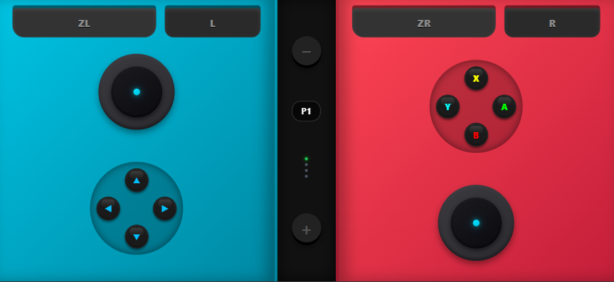
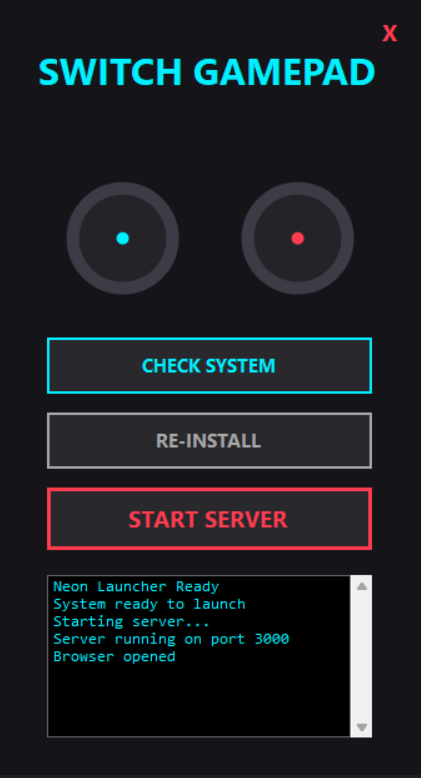
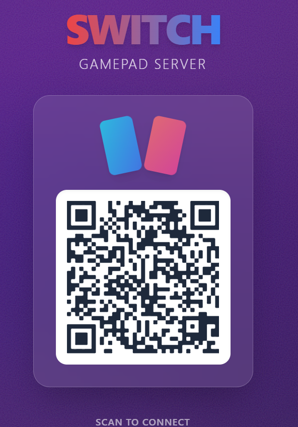

# Switch Gamepad (Neon Edition) 🎮

<p align="center">
  
  
  
</p>

Transform your smartphone into a **premium Nintendo Switch-style gamepad** for Ryujinx emulator. Features draggable analog sticks, neon UI, and zero-configuration setup.

## 📋 Overview

This project provides a complete solution for using your mobile device as a wireless gamepad controller for the Ryujinx Switch emulator. It consists of:

- **Native Windows Launcher**: Beautiful C# application with Joy-Con-inspired UI
- **Web-based Gamepad**: Responsive mobile interface with real analog stick controls
- **WebSocket Server**: Low-latency communication between devices
- **Automatic Setup**: One-click dependency installation and configuration

Perfect for playing Switch games on your PC while using your phone as a controller - no additional hardware required!

## 🚀 Quick Start

### Windows Installation

1. **Download the project** or clone from GitHub
2. **Double-click `SwitchGamepad.exe`**
3. Click **"SETUP AND INSTALL"** (first time only - installs Node.js dependencies)
4. Click **"START SERVER"** 
5. **Scan the QR code** with your mobile device
6. Start playing! 🎮

### Linux / macOS Installation

```bash
# Install dependencies
cd client && npm install && npm run build
cd ../server && npm install

# Start server
npm start

# Open browser to http://localhost:3000
```

**Note**: Manually configure firewall to allow TCP port 3000.

## 🚀 Features

-   **Draggable Analog Sticks**: Touch-responsive pads that follow your finger movement
-   **Native Launcher**: Premium UI with analog stick representations and gamepad icon
-   **Zero Config**: Automatic IP detection (Wi-Fi priority), QR code generation
-   **Automated Setup**: One-click install and launch on Windows
-   **Smart Network**: Auto-detects server IP for correct QR generation
-   **Session Persistence**: Same device reconnects as same player automatically
-   **Server Cleanup**: Automatically stops server when launcher closes

## 🏗️ Architecture & Technology Stack

### Frontend (Client)
- **Framework**: React 18 + Vite
- **UI Components**: Custom analog stick controls, action buttons, shoulder buttons
- **Styling**: CSS with neon gradients and glassmorphism effects
- **Real-time Communication**: Socket.IO client
- **QR Code**: react-qr-code for connection sharing
- **Build**: Vite for optimized production bundle

### Backend (Server)
- **Runtime**: Node.js + TypeScript
- **Framework**: Express.js for HTTP server
- **WebSocket**: Socket.IO for real-time bidirectional communication
- **Room Management**: Custom room system with player slots (1-4)
- **Input Plugin**: Ryujinx keyboard mapper (optional robotjs for actual input)
- **Network**: Auto-detection with Wi-Fi prioritization

### Native Launcher
- **Language**: C# (.NET Framework 4.x)
- **UI**: Windows Forms with custom-drawn analog pads
- **Features**: 
  - Embedded gamepad icon (extracted from joy.cpl)
  - Process management (npm install, build, server start/stop)
  - Automatic firewall configuration
  - Server cleanup on close

### Communication Flow
```
Mobile Device (Client) 
    ↓ WebSocket (Socket.IO)
Server (Room Manager)
    ↓ Plugin System
Ryujinx Emulator (Keyboard Input)
```

### Session Management
- **Client ID**: UUID stored in browser localStorage
- **Reconnection**: Same clientId = same player slot
- **Room System**: Single room, 4 player slots, automatic slot assignment

## 🌐 Network & Firewall

### Automatic Configuration (Windows)
The native launcher automatically:
- ✅ Detects your local IP address (prioritizes Wi-Fi)
- ✅ Configures Windows Firewall rule for TCP port 3000
- ✅ Generates QR code with correct server address

### Manual Configuration (Linux/macOS)
```bash
# Allow TCP port 3000 in your firewall
sudo ufw allow 3000/tcp  # Ubuntu/Debian
sudo firewall-cmd --add-port=3000/tcp --permanent  # Fedora/RHEL
```

### Network Requirements
- **Server**: PC running the launcher (Windows/Linux/macOS)
- **Client**: Mobile device with web browser
- **Connection**: Both devices on the same Wi-Fi network
- **Port**: TCP 3000 (configurable via PORT environment variable)

## 📦 Quick Start (Windows)

1.  **Double-click** `SwitchGamepad.bat`
2.  Click **"SETUP AND INSTALL"** (first time only)
3.  Click **"START SERVER"**
    -   Browser opens automatically
4.  Scan the QR code with your mobile device

## 💻 Operating System Support

### Windows (Recommended)
-   **Automated Setup**: `SwitchGamepad.bat` handles everything
-   **Firewall**: Automatically configures Port 3000 rules

### Linux / macOS
Works via terminal:
1.  **Client**: `cd client && npm install && npm run build`
2.  **Server**: `cd server && npm install && npm start`
3.  **Firewall**: Manually allow TCP Port 3000

## 🕹️ Input Control (Ryujinx)
By default, the server runs in **Safe Mode** (logging inputs only).

**To enable real Keyboard Control:**
1.  Install `robotjs` in the `server` folder: `npm install robotjs`
    -   *Note*: Requires build tools (C++).
2.  Restart the server.

### Keyboard Mappings (4 Players)

Each player has dedicated keyboard bindings to avoid conflicts:

**Layout**: D-Pad (LEFT side of controller) | Action Buttons (RIGHT side)

| Button | Player 1 | Player 2 | Player 3 | Player 4 |
|--------|----------|----------|----------|----------|
| **A** | L | Numpad 6 | P | Period |
| **B** | K | Numpad 2 | ; | Comma |
| **X** | I | Numpad 8 | ' | M |
| **Y** | J | Numpad 4 | L | N |
| **L** | U | Numpad 7 | [ | - |
| **R** | O | Numpad 9 | ] | = |
| **ZL** | 7 | Numpad / | 9 | 5 |
| **ZR** | 8 | Numpad * | 0 | 6 |
| **Start** | Enter | Numpad Enter | Backspace | Tab |
| **Select** | Shift | Numpad - | \\ | Caps Lock |
| **D-Pad Up** | W | ↑ | T | Y |
| **D-Pad Down** | S | ↓ | G | B |
| **D-Pad Left** | A | ← | F | V |
| **D-Pad Right** | D | → | H | N |

> **Note**: Configure Ryujinx to use these keyboard bindings for each player controller.

## 🔄 Session Persistence
**The same user reconnecting is automatically recognized!**
- Each device gets a unique `clientId` stored in browser localStorage
- If you close the browser and reopen it, you'll rejoin as the same player
- Opening multiple tabs/windows from the same device = same player
- This prevents accidental duplicate connections

### Testing Session Persistence
1. Open browser DevTools (F12)
2. Console: `localStorage.getItem('gamepad_client_id')`
3. Note the ID value
4. Close and reopen browser
5. Check again - **same ID = working!** ✅

## ⚙️ Advanced Configuration
To run on a public server (VPS/Cloud), set the `PUBLIC_HOST` environment variable:
```bash
set PUBLIC_HOST=my-gamepad.com
npm start
```

## 🔄 Updates & Maintenance

### Updating the Application
The client is a static build served by the server. To update:

1. **Pull latest changes** from repository
2. **Rebuild client**: `cd client && npm run build`
3. **Restart server** via launcher or `npm start`
4. **Mobile clients**: Hard refresh browser (Ctrl+Shift+R) or clear cache

### Version Management
- Client version is embedded in the build
- No automatic update notification currently implemented
- Users must manually refresh to get latest client version

### Future Improvements
Consider implementing:
- Service Worker for offline support and update notifications
- Version checking endpoint to notify users of updates
- Automatic cache invalidation on new builds

## 📱 Troubleshooting
-   **Device can't connect?** Ensure devices are on the same Wi-Fi. Check Firewall settings.
-   **Launcher fails?** Check that Node.js is installed and accessible from command line.

## 📄 License
MIT
