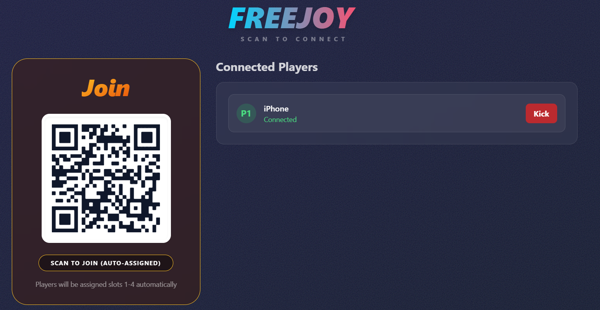
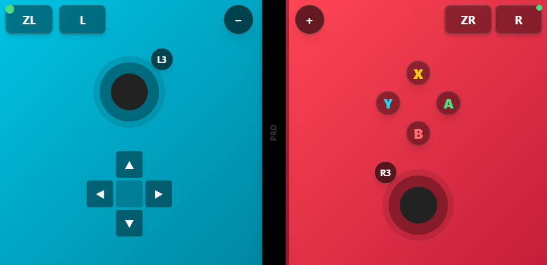

# FreeJoy - Universal Wireless Gamepad

## In plain English

FreeJoy turns phones and tablets into game controllers for a Windows PC, so a group can play together without owning a separate physical gamepad for every person. One computer hosts the room; players scan a QR code and their touch controls are translated into virtual Xbox 360 controllers.

**Example:** during a four-player game night, the host opens FreeJoy on the PC and friends join with their phones. Each person receives a player slot, can reconnect after the phone sleeps, and controls the emulator through the same familiar layout.

| Feature | What it means for players |
| --- | --- |
| QR-code connection | Joining does not require installing or pairing a separate mobile app. |
| Automatic player slots | Up to four people can join without manually configuring every controller. |
| Virtual Xbox 360 devices | Compatible Windows games and emulators see ordinary controller inputs. |
| Session reconnection | Refreshing the browser or waking a phone does not immediately lose the assigned player. |
| Host controls | The person running the game can see, remove, or reset connected players from one screen. |

> **Maturity and limits:** FreeJoy is a working Windows/Ryujinx prototype. It
> depends on a local network and Python's `vgamepad`; latency has not been
> independently benchmarked, and broader emulator support is not claimed.

## Technical summary

FreeJoy is a full-stack controller solution that turns any mobile device into a networked gamepad for PC emulators. It features a Node.js/Socket.IO backend using `vgamepad` for virtual Xbox 360 controller emulation and a React frontend with a Pro Controller UI.

## ⚡ Main Features

*   **Zero-Config Connection**: Scan a single QR code to connect instantly - player slots are auto-assigned.
    
    

*   **Pro Controller Layout**: All players use the same full-featured Pro Controller UI with dual analog sticks, split Joy-Con style layout (cyan left, red right), LED player indicators, and neon-glowing controls.
    
    

*   **Virtual Gamepad Emulation**: Creates true Xbox 360 virtual controllers via Python's `vgamepad` library.
*   **Player Management**: 
    *   Real-time connected players list on host screen
    *   Custom device nicknames (e.g. "iPhone di Antonio")
    *   Kick individual players (online or offline)
    *   Reset room to clear all players and ban list
*   **Persistent Sessions**: Auto-reconnect logic restores player slots if the browser refreshes or device sleeps.
*   **Auto-Assignment**: Players are automatically assigned slots 1-4 in order of connection.
*   **Kick Protection**: Kicked players cannot rejoin until room is reset.
*   **Premium UI**: 
    *   Animated splash screen during connection
    *   Visual LED player indicator (P1-P4)
    *   Neon glow effects on all buttons
    *   Glossy 3D button styling
    *   Haptic feedback on button press
*   **Smart Layouts**: 
    *   **Landscape Lock**: Enforces landscape orientation for maximum playability.
    *   **Safe Area Handling**: Optimized for notched phones and tablets.

## 🎮 Supported Emulators

*   **Ryujinx** (Nintendo Switch) - Primary target

## 🚀 Quick Start

### Prerequisites

*   **Node.js** 20.19+ (20.x) or 22.12+ and npm
*   **Python** 3.8+ with `vgamepad` library
*   **Windows** (required for `vgamepad` Xbox 360 controller emulation)

### Installation

1.  **Clone the repository**:
    
    ```bash
    git clone <repo-url>
    cd ryujinx-gamepad
    ```
    
2.  **Install Node.js dependencies**:
    
    ```bash
    # Server
    cd server
    npm install
    
    # Client
    cd ../client
    npm install
    ```
    
3.  **Install Python dependencies**:
    
    ```bash
    cd ../server/src/python
    pip install vgamepad
    ```

### Running the Application

**Option 1: PowerShell Launcher (Recommended)**

```powershell
./Launcher.ps1
```

This script:
- Builds the client (production-optimized Vite bundle)
- Starts the Node.js server
- Generates separate host/controller capabilities and opens the authorized host page

**Option 2: Manual Start**

```bash
# Terminal 1: Start server
cd server
npm run dev

# Open the capability-bearing Host URL printed by the server.
```

### Connecting Controllers

1.  **Host Screen**: Open the `Host URL` printed by the server to see the QR code
2.  **Mobile Devices**: Scan the QR code with your phone/tablet camera
3.  **Auto-Assignment**: Players are automatically assigned slots P1-P4
4.  **Start Playing**: The virtual Xbox 360 controller is ready in Ryujinx!

## 📱 Player Management

**Host Features:**
- View all connected players with real-time status
- See custom device nicknames
- Kick any player (connected or disconnected)
- Reset entire room to start fresh

**Player Features:**
- Custom nickname on first connection (saved in browser)
- Automatic reconnection on refresh/sleep
- Clear feedback when kicked

## 🎯 Button Mapping

The Pro Controller layout maps to Xbox 360 as follows:

| **Switch** | **Xbox 360** |
|-----------|-------------|
| A | B |
| B | A |
| X | Y |
| Y | X |
| L / ZL | LB / LT |
| R / ZR | RB / RT |
| D-Pad | D-Pad |
| Left Stick | Left Stick |
| Right Stick | Right Stick |
| - (Minus) | Back |
| + (Plus) | Start |

## 🏗️ Architecture

### Stack
*   **Backend**: Node.js + Express + Socket.IO + TypeScript
*   **Frontend**: React (Vite) + Socket.IO Client
*   **Gamepad**: Python `vgamepad` (Xbox 360 emulation)

### How It Works

1.  **Connection**: Client scans QR → WebSocket connection established
2.  **Assignment**: Server auto-assigns slot (1-4) based on availability
3.  **Input Flow**: 
    - Browser captures touch events
    - Socket.IO sends to server
    - Node.js forwards to Python via stdin
    - Python controls virtual Xbox 360 gamepad
4.  **Reconnection**: UUID in localStorage allows slot persistence

### Key Design Decisions

*   **Single Python Process**: One process manages all 4 virtual controllers efficiently
*   **Ephemeral Room IDs**: Short alphanumeric codes for easy sharing
*   **Separate Capabilities**: Host administration and controller joining use independently configurable tokens
*   **Fail-Safe Lifecycle**: Disconnect, kick, reset, timeout, and shutdown neutralize each active virtual controller once
*   **Stateless Sessions**: No database - all state in memory for minimal latency
*   **Device Nicknames**: Stored in browser localStorage for personalization
*   **Controller Lease**: A ten-second heartbeat makes an unresponsive controller fail safe after thirty seconds
*   **Kick Semantics**: Blocks the stored controller identity until reset; rotate the shared join capability when actual QR-code revocation is required

## 🔧 Configuration

| Environment variable | Default | Purpose |
| --- | --- | --- |
| `PORT` | `3000` | HTTP and Socket.IO port |
| `PUBLIC_HOST` | detected LAN address | Address placed in the controller QR URL |
| `FREEJOY_HOST_TOKEN` | random at startup | Host API and administration capability; minimum 16 characters |
| `FREEJOY_JOIN_TOKEN` | random at startup | Controller join capability; minimum 16 characters |
| `FREEJOY_INPUT_EVENTS_PER_SECOND` | `120` | Per-controller input ceiling, from 10 to 1000; the current window survives reconnects, and overflow safely releases without creating a host ban |

Capabilities are carried in URL fragments, so browsers do not send them in the initial HTTP request. Host and join values must differ. A restart rotates generated capabilities and invalidates old QR codes; deployments that configure a fixed join value must change it explicitly when revoking a QR code.

### Python Path

Edit `server/src/plugins/RyujinxPlugin.ts` if Python is not in PATH:

```typescript
this.pythonProcess = spawn('python', [...], {
    // Add custom python path if needed
});
```

## 🐛 Troubleshooting

### Controllers Not Detected in Ryujinx

1.  Check Windows Device Manager for "Xbox 360 Controller for Windows"
2.  Ensure `vgamepad` is installed: `pip show vgamepad`
3.  Restart Ryujinx after connecting controllers
4.  Check server console for Python errors

### Connection Issues

*   **QR Code Not Scanning**: Ensure phone and PC are on same network
*   **"Room Full" Error**: Maximum 4 players - use Reset Room button
*   **Kicked Player Rejoining**: Room reset clears ban list
*   **Reconnection Fails**: Clear browser data and scan QR again

### Input Lag

*   Use 5GHz WiFi for best performance
*   Close background apps on mobile device
*   Reduce distance between device and router

## 📝 Development

### Project Structure

```
ryujinx-gamepad/
├── client/                 # React frontend (Vite)
│   ├── src/
│   │   ├── components/
│   │   │   ├── ProController.tsx    # Main controller UI
│   │   │   └── InstallBanner.jsx    # PWA install prompt
│   │   ├── App.jsx                  # Host + routing logic
│   │   └── main.jsx
│   └── package.json
├── server/                 # Node.js backend
│   ├── src/
│   │   ├── plugins/
│   │   │   ├── IPlugin.ts           # Plugin interface
│   │   │   └── RyujinxPlugin.ts     # vgamepad integration
│   │   ├── python/
│   │   │   └── virtual_gamepad.py   # Xbox controller emulation
│   │   ├── server.ts                # Express + Socket.IO server
│   │   ├── authority.ts             # Host/controller capabilities
│   │   ├── protocol.ts              # Validated controller protocol
│   │   ├── roomManager.ts           # Player/room state
│   │   ├── wsHandler.ts             # WebSocket events
│   │   └── types.ts                 # TypeScript types
│   └── package.json
├── docs/                   # Screenshots
├── Launcher.ps1            # PowerShell launcher script
└── README.md
```

### Adding New Emulator Support

1.  Create plugin in `server/src/plugins/YourEmulator.ts`
2.  Implement `IPlugin` interface
3.  Wire it in `server/src/server.ts`

## 🎨 UI Customization

### Button Styling

Edit `client/src/components/ProController.tsx` - all buttons use inline styles with CSS-in-JS for neon effects.

### Color Scheme

Primary colors:
- Left Joy-Con: `#00C3E3` (Cyan)
- Right Joy-Con: `#FF4D6D` (Red)
- ABXY: Individual neon colors (Green/Red/Yellow/Cyan)

## 📄 License

MIT License - See LICENSE file

## 🙏 Acknowledgments

*   [vgamepad](https://github.com/yannbouteiller/vgamepad) - Xbox controller emulation
*   [Socket.IO](https://socket.io/) - Real-time communication
*   [React Joystick Component](https://github.com/elmarti/react-joystick-component) - Analog stick UI

---

**Note**: This project requires Windows for `vgamepad` Xbox 360 controller emulation. Linux/Mac support would require alternative virtual gamepad solutions., from the draggable analog sticks to the seamless mobile experience, every line of code was a collaborative dance between human creativity and AI precision.

> *"Any sufficiently advanced AI is indistinguishable from a very caffeinated developer at 3 AM."*  
> — Arthur C. Clarke (probably)

Special thanks to Antigravity for:
- 🎨 Making the Controller aesthetics actually look premium
- 🐛 Debugging PowerShell scripts that shall not be named
- 🎮 Remembering that D-Pads go on the LEFT side of controllers
- 📱 Teaching me that Wi-Fi interfaces have many names (wlan, wl, wi-fi, wireless...)
- ✨ And for never judging my "just one more feature" requests

*P.S. - If this README seems suspiciously well-organized, that's because an AI wrote it. If you find bugs, that's all me.* 😄

---

## 👨‍💻 Author

**Antonio Antenore**  
Computer Engineer
